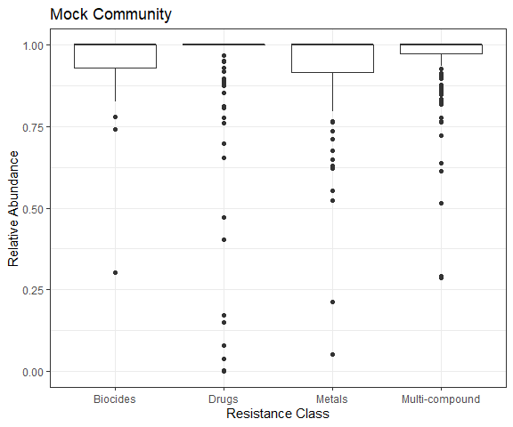
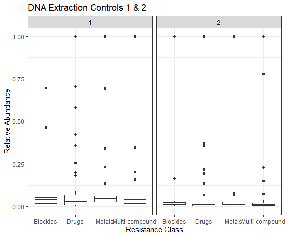
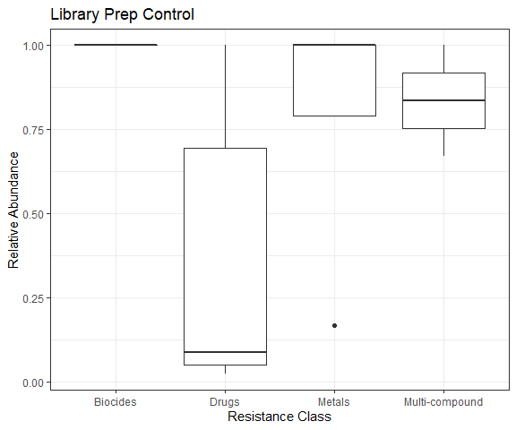

Report on Controls
================
Emily Bean
March 25, 2020

### Positive Control - Mock Community

There are 397 genes detected in the mock community.

### Negative Control - DNA Extraction

There are 2 DNA extraction controls. There are 273 genes detected in the 1st control and 141 detected in the 2nd control.

### Negative Control - Library Preparation

There are only 24 genes detected in this negative control.

