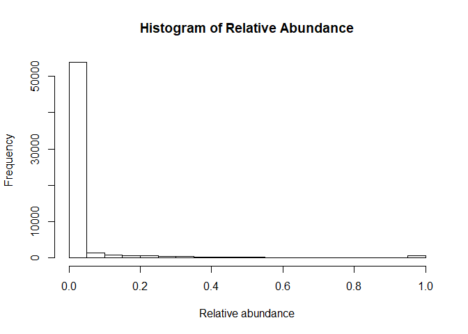

AMR Analysis
================
Emily Bean
March 12, 2020

Analysis Structure
------------------

**Comparisons**

Pairwise comparisons between Farm 1 and Farm 2.
Comparisons between body sites (rumen, feces, nasal swab) at each farm.

MEGARES database categories include: type of resistance, resistance class within type (i.e. type of drug within Drug resistance), protein class, and gene. Pairwise comparisons can be made for all of these but it seems to make the most biological sense to compare genes, protein classes, and resistance classes.

------------------------------------------------------------------------

Therefore, here is the proposed comparison structure:
Genes: Farm 1 vs Farm 2
Proteins: Farm 1 vs Farm 2
Resistance class: Farm 1 vs Farm 2

Genes: SNP vs Rumen vs Feces (Farm 1 and Farm 2)
Proteins: SNP vs Rumen vs Feces (Farm 1 and Farm 2)
Resistance class: SNP vs Rumen vs Feces (Farm 1 and Farm 2)

------------------------------------------------------------------------

There are negative and positive controls that need to be accounted for.

**Data normalization**

1.  Normalize to gene length by dividing gene count by the average gene length (note: MEGARES database combines all SNP mutations from other databases into one gene category, so gene lengths differ for each mutation).
2.  Normalize to sequencing depth by dividing gene count by the number of reads in each sample (number of reads after trimming and merging).
3.  No normalization; gene count only.

**Linear regression assumptions**

The gene count data is very zero skewed, a log transformation helps. We may be better off with non-parametric comparisons than trying to further transform the data.

### Data Exploration

``` r
# in the entire dataset, there are 174 unique proteins in 3 classes
exp <- counts %>% 
  group_by(class, type, protein) %>% 
  summarize()

# show unique proteins
knitr::kable(exp)
```

| class          | type                                                | protein                                                       |
|:---------------|:----------------------------------------------------|:--------------------------------------------------------------|
| Biocides       | Acetate\_resistance                                 | Acetate\_resistance\_protein                                  |
| Biocides       | Acid\_resistance                                    | Acid\_resistance\_protein                                     |
| Biocides       | Acid\_resistance                                    | Acid\_resistance\_regulator                                   |
| Biocides       | Biguanide\_resistance                               | Biguanide\_cation\_efflux                                     |
| Biocides       | Multi-biocide\_resistance                           | Multi-biocide\_ABC\_efflux\_pump                              |
| Biocides       | Multi-biocide\_resistance                           | Multi-biocide\_MATE\_efflux\_pump                             |
| Biocides       | Multi-biocide\_resistance                           | Multi-biocide\_MFS\_efflux\_pump                              |
| Biocides       | Multi-biocide\_resistance                           | Multi-biocide\_resistance\_protein                            |
| Biocides       | Multi-biocide\_resistance                           | Multi-biocide\_resistance\_regulator                          |
| Biocides       | Multi-biocide\_resistance                           | Multi-biocide\_RND\_efflux\_pump                              |
| Biocides       | Multi-biocide\_resistance                           | Multi-biocide\_RND\_efflux\_regulator                         |
| Biocides       | Multi-biocide\_resistance                           | Multi-biocide\_SMR\_efflux\_pump                              |
| Biocides       | Paraquat\_resistance                                | Paraquat\_resistance\_protein                                 |
| Biocides       | Peroxide\_resistance                                | peroxide\_resistance\_protein                                 |
| Biocides       | Peroxide\_resistance                                | Peroxide\_resistance\_stress\_protein                         |
| Biocides       | Phenolic\_compound\_resistance                      | Phenolic\_resistance\_protein                                 |
| Biocides       | Phenolic\_compound\_resistance                      | Phenolic\_RND\_efflux\_pump                                   |
| Biocides       | Phenolic\_compound\_resistance                      | Triclosan-resistant\_mutation                                 |
| Biocides       | Quaternary\_Ammonium\_Compounds\_(QACs)\_resistance | QAC-resistant\_protein\_UDP\_glucose\_4\_epimerase            |
| Biocides       | Quaternary\_Ammonium\_Compounds\_(QACs)\_resistance | QAC\_efflux\_pump                                             |
| Drugs          | Aminocoumarins                                      | Aminocoumarin-resistant\_DNA\_topoisomerases                  |
| Drugs          | Aminocoumarins                                      | Aminocoumarin\_efflux\_pump                                   |
| Drugs          | Aminoglycosides                                     | 16S\_rRNA\_methyltransferases                                 |
| Drugs          | Aminoglycosides                                     | Aminoglycoside-resistant\_16S\_ribosomal\_subunit\_protein    |
| Drugs          | Aminoglycosides                                     | Aminoglycoside\_efflux\_pumps                                 |
| Drugs          | Aminoglycosides                                     | Aminoglycoside\_N-acetyltransferases                          |
| Drugs          | Aminoglycosides                                     | Aminoglycoside\_O-nucleotidyltransferases                     |
| Drugs          | Aminoglycosides                                     | Aminoglycoside\_O-phosphotransferases                         |
| Drugs          | Bacitracin                                          | Bacitracin\_ABC\_transporter                                  |
| Drugs          | Bacitracin                                          | Undecaprenyl\_pyrophosphate\_phosphatase                      |
| Drugs          | betalactams                                         | Class\_A\_betalactamases                                      |
| Drugs          | betalactams                                         | Class\_B\_betalactamases                                      |
| Drugs          | betalactams                                         | Class\_C\_betalactamases                                      |
| Drugs          | betalactams                                         | Class\_D\_betalactamases                                      |
| Drugs          | betalactams                                         | Mutant\_porin\_proteins                                       |
| Drugs          | betalactams                                         | Penicillin\_binding\_protein                                  |
| Drugs          | betalactams                                         | Penicillin\_binding\_protein\_regulator                       |
| Drugs          | Cationic\_antimicrobial\_peptides                   | Cationic\_peptide-resistant\_16S\_ribosomal\_subunit\_protein |
| Drugs          | Cationic\_antimicrobial\_peptides                   | Defensin-resistant\_mprF                                      |
| Drugs          | Cationic\_antimicrobial\_peptides                   | Lipid\_A\_modification                                        |
| Drugs          | Cationic\_antimicrobial\_peptides                   | Polymyxin\_B\_resistance\_regulator                           |
| Drugs          | Elfamycins                                          | EF-Tu\_inhibition                                             |
| Drugs          | Elfamycins                                          | Elfamycin\_efflux\_pumps                                      |
| Drugs          | Fluoroquinolones                                    | Fluoroquinolone-resistant\_DNA\_topoisomerases                |
| Drugs          | Fluoroquinolones                                    | Fluoroquinolone\_ABC\_efflux\_pump                            |
| Drugs          | Fluoroquinolones                                    | Quinolone\_active\_efflux                                     |
| Drugs          | Fluoroquinolones                                    | Quinolone\_resistance\_protein\_Qnr                           |
| Drugs          | Fosfomycin                                          | Fosfomycin\_MFS\_efflux\_pump                                 |
| Drugs          | Fosfomycin                                          | Fosfomycin\_phosphorylation                                   |
| Drugs          | Fosfomycin                                          | Fosfomycin\_target\_mutation                                  |
| Drugs          | Fosfomycin                                          | Fosfomycin\_thiol\_transferases                               |
| Drugs          | Fusidic\_acid                                       | Fusidic\_acid-resistant\_mutation                             |
| Drugs          | Glycopeptides                                       | Bleomycin\_resistance\_protein                                |
| Drugs          | Glycopeptides                                       | VanA-type\_accessory\_protein                                 |
| Drugs          | Glycopeptides                                       | VanA-type\_regulator                                          |
| Drugs          | Glycopeptides                                       | VanA-type\_resistance\_protein                                |
| Drugs          | Glycopeptides                                       | VanB-type\_regulator                                          |
| Drugs          | Glycopeptides                                       | VanB-type\_resistance\_protein                                |
| Drugs          | Glycopeptides                                       | VanC-type\_regulator                                          |
| Drugs          | Glycopeptides                                       | VanC-type\_resistance\_protein                                |
| Drugs          | Glycopeptides                                       | Vancomycin-resistant\_mutation                                |
| Drugs          | Glycopeptides                                       | VanD-type\_accessory\_protein                                 |
| Drugs          | Glycopeptides                                       | VanD-type\_regulator                                          |
| Drugs          | Glycopeptides                                       | VanD-type\_resistance\_protein                                |
| Drugs          | Glycopeptides                                       | VanE-type\_regulator                                          |
| Drugs          | Glycopeptides                                       | VanE-type\_resistance\_protein                                |
| Drugs          | Glycopeptides                                       | VanF-type\_accessory\_protein                                 |
| Drugs          | Glycopeptides                                       | VanG-type\_regulator                                          |
| Drugs          | Glycopeptides                                       | VanG-type\_resistance\_protein                                |
| Drugs          | Glycopeptides                                       | VanI-type\_resistance\_protein                                |
| Drugs          | Glycopeptides                                       | VanL-type\_regulator                                          |
| Drugs          | Glycopeptides                                       | VanM-type\_regulator                                          |
| Drugs          | Glycopeptides                                       | VanM-type\_resistance\_protein                                |
| Drugs          | Glycopeptides                                       | VanN-type\_resistance\_protein                                |
| Drugs          | Glycopeptides                                       | VanO-type\_regulator                                          |
| Drugs          | Glycopeptides                                       | VanO-type\_resistance\_protein                                |
| Drugs          | Lipopeptides                                        | Colistin-resistant\_mutant                                    |
| Drugs          | Lipopeptides                                        | Colistin\_phosphoethanolamine\_transferase                    |
| Drugs          | Lipopeptides                                        | Daptomycin-resistant\_beta-subunit\_of\_RNA\_polymerase\_RpoB |
| Drugs          | Lipopeptides                                        | Daptomycin-resistant\_beta-subunit\_of\_RNA\_polymerase\_RpoC |
| Drugs          | Lipopeptides                                        | Daptomycin-resistant\_mutant                                  |
| Drugs          | Lipopeptides                                        | Lysocin-resistant\_mutant                                     |
| Drugs          | Metronidazole                                       | nim\_nitroimidazole\_reductase                                |
| Drugs          | MLS                                                 | 23S\_rRNA\_methyltransferases                                 |
| Drugs          | MLS                                                 | Lincosamide\_nucleotidyltransferases                          |
| Drugs          | MLS                                                 | Macrolide-resistant\_23S\_rRNA\_mutation                      |
| Drugs          | MLS                                                 | Macrolide\_esterases                                          |
| Drugs          | MLS                                                 | Macrolide\_glycosyltransferases                               |
| Drugs          | MLS                                                 | Macrolide\_phosphotransferases                                |
| Drugs          | MLS                                                 | MLS\_resistance\_ABC\_efflux\_pumps                           |
| Drugs          | MLS                                                 | MLS\_resistance\_MFS\_efflux\_pumps                           |
| Drugs          | MLS                                                 | Streptogramin\_A\_O-acetyltransferase                         |
| Drugs          | MLS                                                 | Streptogramin\_B\_ester\_bond\_cleavage                       |
| Drugs          | Multi-drug\_resistance                              | MDR\_23S\_ribosomal\_RNA\_methyltransferase                   |
| Drugs          | Multi-drug\_resistance                              | MDR\_23S\_rRNA\_mutation                                      |
| Drugs          | Multi-drug\_resistance                              | MDR\_acetyltransferase                                        |
| Drugs          | Multi-drug\_resistance                              | MDR\_mutant\_porin\_proteins                                  |
| Drugs          | Multi-drug\_resistance                              | MDR\_regulator                                                |
| Drugs          | Multi-drug\_resistance                              | Multi-drug\_ABC\_efflux\_pumps                                |
| Drugs          | Multi-drug\_resistance                              | Multi-drug\_MFS\_efflux\_pumps                                |
| Drugs          | Multi-drug\_resistance                              | Multi-drug\_RND\_efflux\_pumps                                |
| Drugs          | Multi-drug\_resistance                              | Multi-drug\_RND\_efflux\_regulator                            |
| Drugs          | Mupirocin                                           | Mupirocin-resistant\_isoleucyl-tRNA\_synthetase               |
| Drugs          | Mycobacterium\_tuberculosis-specific\_Drug          | Ethambutol-resistant\_mutant                                  |
| Drugs          | Mycobacterium\_tuberculosis-specific\_Drug          | Ethionamide-resistant\_mutant                                 |
| Drugs          | Mycobacterium\_tuberculosis-specific\_Drug          | Isoniazid-resistant\_mutant                                   |
| Drugs          | Mycobacterium\_tuberculosis-specific\_Drug          | Para-aminosalicylic\_acid\_resistant\_mutant                  |
| Drugs          | Mycobacterium\_tuberculosis-specific\_Drug          | Pyrazinamide-resistant\_mutant                                |
| Drugs          | Nucleosides                                         | Streptothricin\_acetyltransferase                             |
| Drugs          | Oxazolidinone                                       | Oxazolidinone-resistant\_23S\_rRNA\_mutation                  |
| Drugs          | Pactamycin                                          | Pactamycin-resistant\_16S\_ribosomal\_subunit\_protein        |
| Drugs          | Phenicol                                            | Chloramphenicol\_acetyltransferases                           |
| Drugs          | Phenicol                                            | Chloramphenicol\_hydrolase                                    |
| Drugs          | Phenicol                                            | Chloramphenicol\_phosphotransferase                           |
| Drugs          | Phenicol                                            | Phenicol-resistant\_23S\_rRNA\_mutation                       |
| Drugs          | Phenicol                                            | Phenicol\_resistance\_MFS\_efflux\_pumps                      |
| Drugs          | Pleuromutilin                                       | Pleuromutilin-resistant\_23S\_rRNA\_mutation                  |
| Drugs          | Rifampin                                            | Monooxygenase                                                 |
| Drugs          | Rifampin                                            | Rifampin-resistant\_beta-subunit\_of\_RNA\_polymerase\_RpoB   |
| Drugs          | Rifampin                                            | Rifampin\_ADP-ribosyltransferase\_Arr                         |
| Drugs          | Rifampin                                            | Rifampin\_phosphotransferase                                  |
| Drugs          | Rifampin                                            | RNA-polymerase\_binding\_protein                              |
| Drugs          | Sulfonamides                                        | Sulfonamide-resistant\_dihydropteroate\_synthases             |
| Drugs          | Tetracenomycin                                      | Tetracenomycin\_MFS\_efflux\_pump                             |
| Drugs          | Tetracyclines                                       | Tetracycline-resistant\_16S\_ribosomal\_subunit\_protein      |
| Drugs          | Tetracyclines                                       | Tetracycline\_inactivation\_enzymes                           |
| Drugs          | Tetracyclines                                       | Tetracycline\_resistance\_ABC\_efflux\_pumps                  |
| Drugs          | Tetracyclines                                       | Tetracycline\_resistance\_MFS\_efflux\_pumps                  |
| Drugs          | Tetracyclines                                       | Tetracycline\_resistance\_MFS\_efflux\_regulator              |
| Drugs          | Tetracyclines                                       | Tetracycline\_resistance\_ribosomal\_protection\_proteins     |
| Drugs          | Tetracyclines                                       | Tetracycline\_transcriptional\_repressor                      |
| Drugs          | Trimethoprim                                        | Dihydrofolate\_reductase                                      |
| Metals         | Aluminum\_resistance                                | Aluminum\_ATPase\_                                            |
| Metals         | Arsenic\_resistance                                 | Arsenic\_resistance\_protein                                  |
| Metals         | Arsenic\_resistance                                 | Arsenic\_resistance\_regulator                                |
| Metals         | Arsenic\_resistance                                 | Arsenite\_oxidase\_regulator                                  |
| Metals         | Cadmium\_resistance                                 | Cadmium\_resistance\_regulator                                |
| Metals         | Chromium\_resistance                                | Chromium\_resistance\_protein                                 |
| Metals         | Cobalt\_resistance                                  | Cobalt\_transporting\_ATPase                                  |
| Metals         | Copper\_resistance                                  | Copper\_resistance\_protein                                   |
| Metals         | Copper\_resistance                                  | Copper\_resistance\_regulator                                 |
| Metals         | Iron\_resistance                                    | Iron\_resistance\_protein                                     |
| Metals         | Lead\_resistance                                    | Lead\_P-type\_ATPase\_transporter                             |
| Metals         | Mercury\_resistance                                 | Mercury\_resistance\_protein                                  |
| Metals         | Mercury\_resistance                                 | Mercury\_resistance\_regulator                                |
| Metals         | Multi-metal\_resistance                             | Multi-metal\_ABC\_efflux\_pumps                               |
| Metals         | Multi-metal\_resistance                             | Multi-metal\_resistance\_protein                              |
| Metals         | Multi-metal\_resistance                             | Multi-metal\_resistance\_regulator                            |
| Metals         | Multi-metal\_resistance                             | Multi-metal\_RND\_efflux\_pumps                               |
| Metals         | Multi-metal\_resistance                             | Multi-metal\_RND\_efflux\_regulator                           |
| Metals         | Nickel\_resistance                                  | Nickel\_ABC\_efflux\_pumps                                    |
| Metals         | Nickel\_resistance                                  | Nickel\_ABC\_efflux\_regulator                                |
| Metals         | Nickel\_resistance                                  | Nickel\_MFS\_efflux\_pumps                                    |
| Metals         | Nickel\_resistance                                  | Nickel\_resistance\_regulator                                 |
| Metals         | Sodium\_resistance                                  | Sodium\_resistance\_protein                                   |
| Metals         | Tellurium\_resistance                               | Tellurium\_resistance\_protein                                |
| Metals         | Zinc\_resistance                                    | Zinc\_resistance\_protein                                     |
| Metals         | Zinc\_resistance                                    | Zinc\_resistance\_regulator                                   |
| Multi-compound | Biocide\_and\_metal\_resistance                     | Biocide\_and\_metal\_ABC\_efflux\_pumps                       |
| Multi-compound | Biocide\_and\_metal\_resistance                     | Biocide\_and\_metal\_resistance\_protein                      |
| Multi-compound | Biocide\_and\_metal\_resistance                     | Biocide\_and\_metal\_resistance\_regulator                    |
| Multi-compound | Drug\_and\_biocide\_and\_metal\_resistance          | Drug\_and\_biocide\_and\_metal\_MFS\_efflux\_pumps            |
| Multi-compound | Drug\_and\_biocide\_and\_metal\_resistance          | Drug\_and\_biocide\_and\_metal\_resistance\_regulator         |
| Multi-compound | Drug\_and\_biocide\_and\_metal\_resistance          | Drug\_and\_biocide\_and\_metal\_RND\_efflux\_pumps            |
| Multi-compound | Drug\_and\_biocide\_and\_metal\_resistance          | Drug\_and\_biocide\_and\_metal\_RND\_efflux\_regulator        |
| Multi-compound | Drug\_and\_biocide\_resistance                      | Drug\_and\_biocide\_ABC\_efflux\_pumps                        |
| Multi-compound | Drug\_and\_biocide\_resistance                      | Drug\_and\_biocide\_ABC\_efflux\_regulator                    |
| Multi-compound | Drug\_and\_biocide\_resistance                      | Drug\_and\_biocide\_MATE\_efflux\_pumps                       |
| Multi-compound | Drug\_and\_biocide\_resistance                      | Drug\_and\_biocide\_MFS\_efflux\_pumps                        |
| Multi-compound | Drug\_and\_biocide\_resistance                      | Drug\_and\_biocide\_MFS\_efflux\_regulator                    |
| Multi-compound | Drug\_and\_biocide\_resistance                      | Drug\_and\_biocide\_RND\_efflux\_pumps                        |
| Multi-compound | Drug\_and\_biocide\_resistance                      | Drug\_and\_biocide\_RND\_efflux\_regulator                    |
| Multi-compound | Drug\_and\_biocide\_resistance                      | Drug\_and\_biocide\_SMR\_efflux\_pumps                        |
| Multi-compound | Drug\_and\_biocide\_resistance                      | Drug\_and\_biocide\_SMR\_efflux\_regulator                    |

``` r
# data is not normally distributed and is very zero-skewed
hist(counts$count, main = "Histogram of gene counts",
     xlab = "Gene count", ylab = "Frequency")
```



``` r
# Log transformation helps (somewhat)
hist(log1p(counts$count), main = "Histogram of log-transformed gene counts",
     xlab = "Log gene count", ylab = "Frequency")
```


The data above only accounts for the genes that are present within each sample; i.e., there is no penalization for a sample that does not have genes that are present within another sample.
